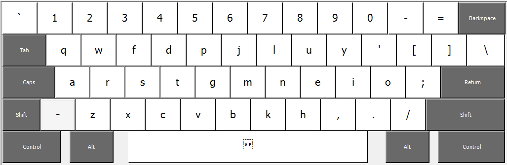

# Colemak Alternative

This is Shai's updated revision of experimental Colemak Layout as in below link :

https://forum.colemak.com/topic/2644-shais-colemak-mod/#p23600

There are 3 total changes compared to the original Colemak. The motivation is to reduce strain by moving D and H out of the center columns while keeping bottom row and shortcuts intact.

- P and D are swapped.
- M and H are swapped.
- ; and ' are swapped.

## Installation
I included a Windows Installer and a AutoHotkey script.
I may include MACOS and Linux installation files in the future as well.
