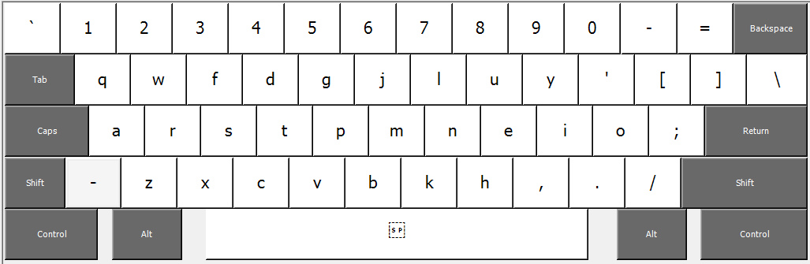

# Colemak Alternative

This is an alternative revision of Colemak Keyboard Layout : 

https://colemak.com/

There are 4 total changes compared to the original Colemak. The motivation is to reduce strain by moving D and H out of the center columns while keeping bottom row and shortcuts intact.

- D <-> P
- p <-> G
- M <-> H
- ; <-> '

## Installation
I included a Windows Installer and a AutoHotkey script.
I may include MACOS and Linux installation files in the future as well.
